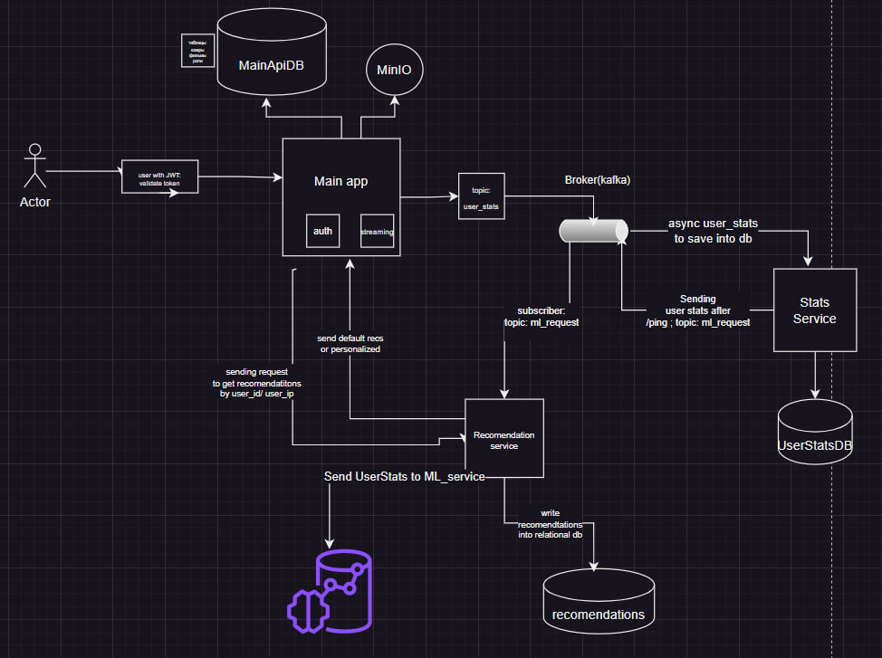

# Main-api - главный сервис в архитектуре:



Main API Service отвечает за:
- Авторизацию и аутентификацию пользователей.
- Управление фильмами (CRUD-операции, загрузка/выгрузка на MinIO).
- Стриминг фильмов.
- Получение рекомендаций через внешний сервис.

Все доступные эндпоинты задокументированы в Swagger UI:
- [Swagger UI](http://localhost:8000/docs)
- [Redoc](http://localhost:8000/redoc)

---

## Эндпоинты

### **Общие**

- **[http://localhost:8000/liveness](http://localhost:8000/liveness)**  
  Проверка работоспособности сервиса.

---

### **Авторизация**

- **[http://localhost:8000/register](http://localhost:8000/register)**  
  Регистрация нового пользователя.

- **[http://localhost:8000/login](http://localhost:8000/login)**  
  Аутентификация пользователя и получение токена доступа.

---

### **Movies**

Эндпоинты, связанные с работой с фильмами. Требуют авторизованного пользователя с ролью `user`.

- **[http://localhost:8000/movies/{movie_id}](http://localhost:8000/movies/{movie_id})**  
  Получить информацию о фильме по его ID.

- **[http://localhost:8000/movies](http://localhost:8000/movies)**  
  Получить список фильмов с поддержкой пагинации.

- **[http://localhost:8000/movies/recs/{user_id}](http://localhost:8000/movies/recs/{user_id})**  
  Получить рекомендации фильмов для пользователя, используя внешний сервис.

---

### **Streaming**

Эндпоинты для стриминга фильмов. Требуют авторизованного пользователя с ролью `user`.

- **[http://localhost:8000/streaming/get/{movie_id}](http://localhost:8000/streaming/get/{movie_id})**  
  Стриминг видео по ID фильма из MinIO.

---

### **Admin**

Эндпоинты для административных задач. Требуют роль `admin`.

- **[http://localhost:8000/admin/users](http://localhost:8000/admin/users)**  
  Получить список всех пользователей.

- **[http://localhost:8000/admin/upload_movie](http://localhost:8000/admin/upload_movie)**  
  Загрузить новый фильм в хранилище и добавить запись в базу данных.

- **[http://localhost:8000/admin/download_movie/{movie_id}](http://localhost:8000/admin/download_movie/{movie_id})**  
  Скачать фильм из MinIO.

- **[http://localhost:8000/admin/delete_movie/{movie_id}](http://localhost:8000/admin/delete_movie/{movie_id})**  
  Удалить фильм из хранилища и базы данных.

- **[http://localhost:8000/admin/update_movie/{movie_id}](http://localhost:8000/admin/update_movie/{movie_id})**  
  Обновить данные о фильме в базе.

---

## Запуск сервиса

1. Клонируйте репозиторий и перейдите в директорию проекта:
   ```bash
   git clone <repository_url>
   cd <repository_directory>
   ```

2. Запустите сервисы с помощью Docker Compose:

    ```
    docker-compose up --build
    ```